<p align="center">
  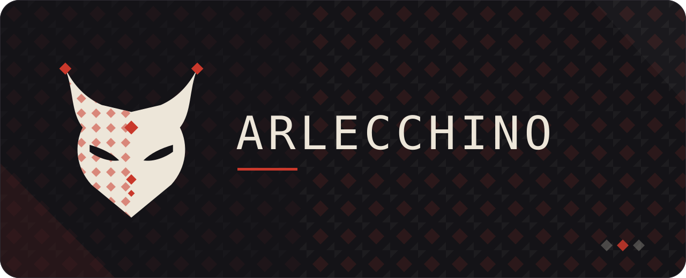
</p>

<p align="center">
  <a href="https://www.nuget.org/packages/Arlecchino"></a>
  <a href="https://www.nuget.org/packages/Arlecchino"></a>
  <a href="https://github.com/The1fEst/Arlecchino/actions/workflows/build.yml"></a>
  
  <a href="LICENSE"></a>
</p>

A terminal UI framework for .NET where a view is a plain class built by
`Microsoft.Extensions.DependencyInjection` and the routes between views are written by a source
generator, so nothing is registered by hand.

<!--
  Recorded headless, without a terminal: `dotnet run tools/shots.cs -- tape` in Arlecchino.Commander
  plays a script through the application, draws a frame wherever the script asks for one and writes
  them here. Re-record it whenever the theme or the dialogs change.
-->
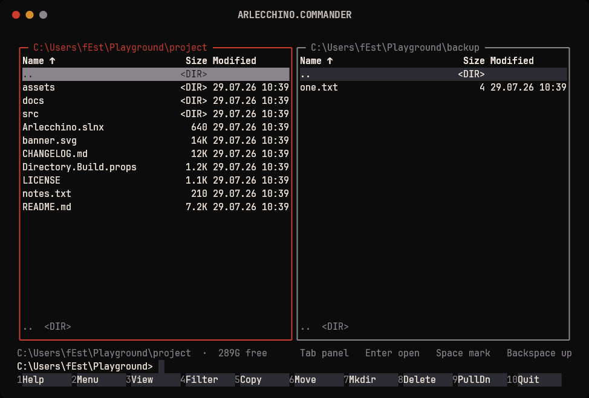

Above: [Arlecchino.Commander](https://github.com/The1fEst/Arlecchino.Commander), an application built
on the framework. The dialog, the notification and the keys screen are the framework's own.

<details>
<summary><b>Sixteen screens</b> — the panels, marks, the menu, file operations, servers, SSH, notifications</summary>

### The panels

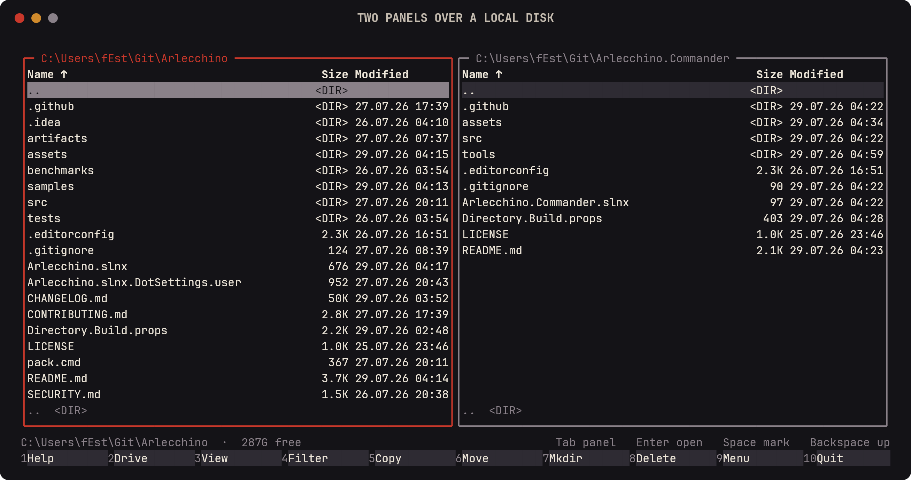

Marks are counted at the foot of the panel:

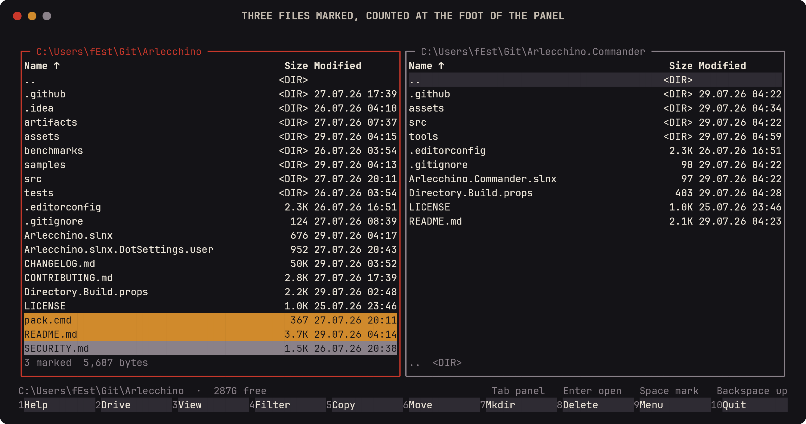

Either panel sorts by name, size or date:

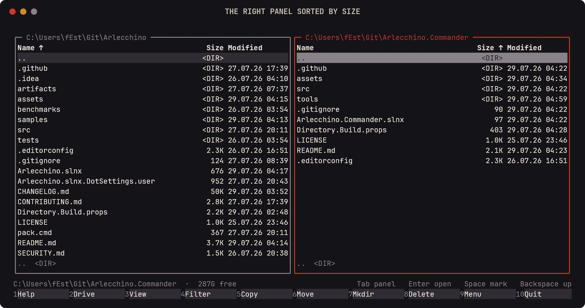

A filter narrows one down:

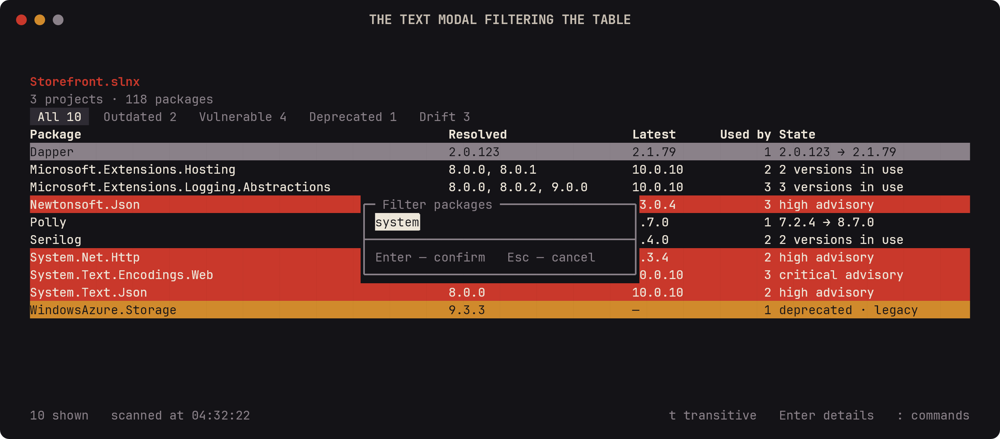

A file is read without leaving them:

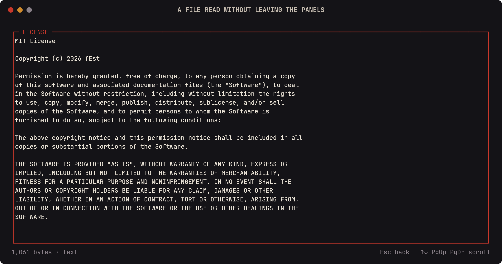

### Menus and operations

`F9` opens the menu, and each section is a list:

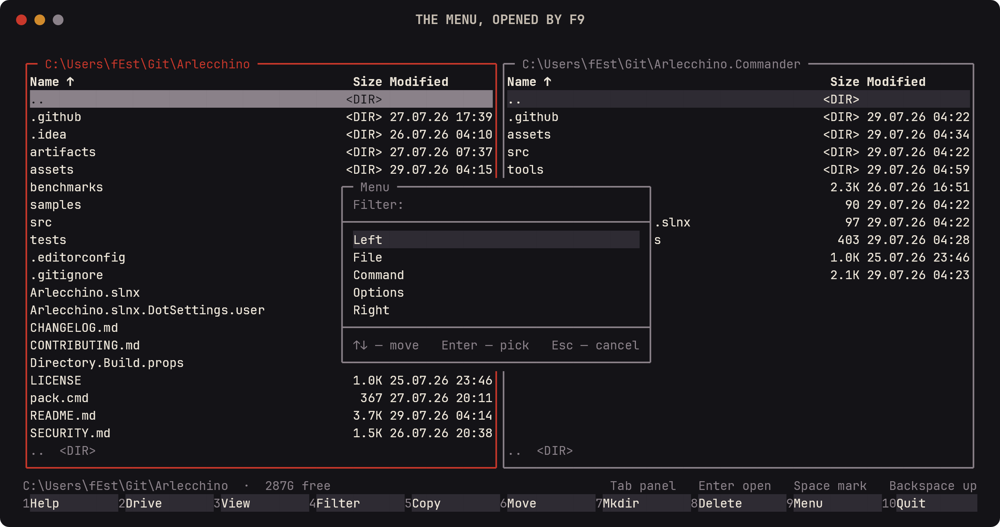

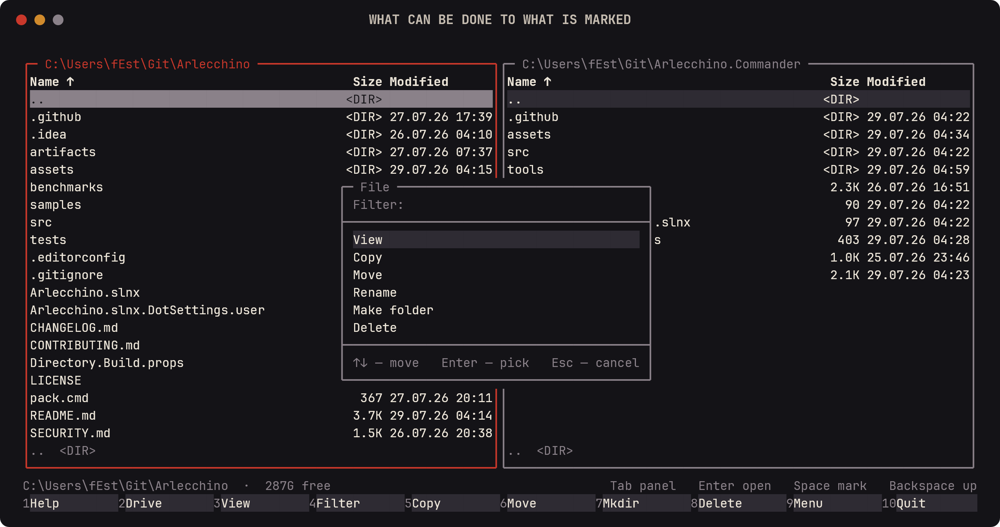

Copying asks where to; deleting asks first, with no selected:

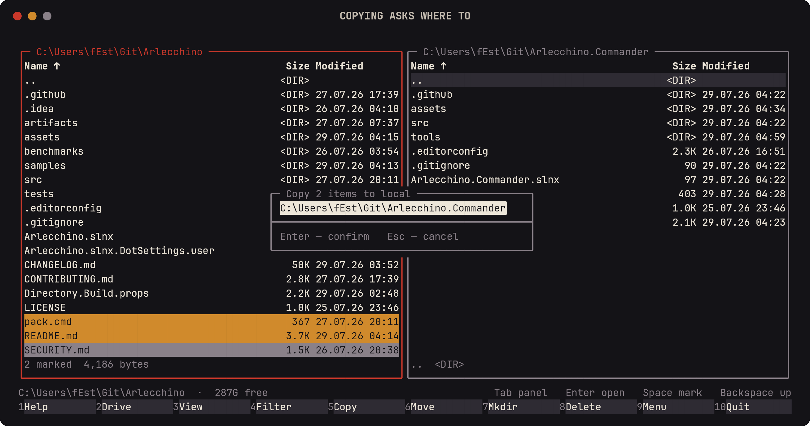

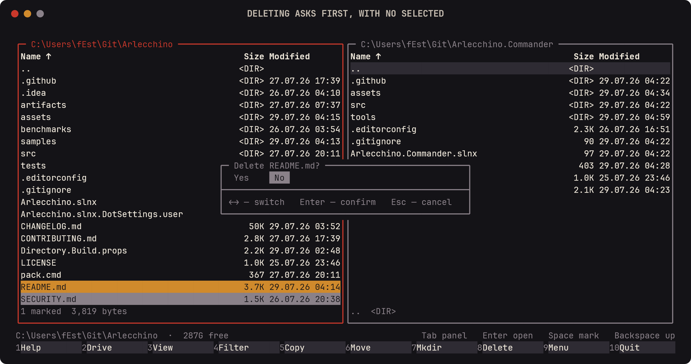

### Work that takes a while

It runs in the background, with a bar and `Esc` to stop:

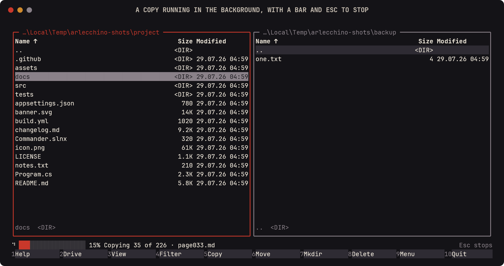

The same copy is a notification, opened in full and offering to stop it:

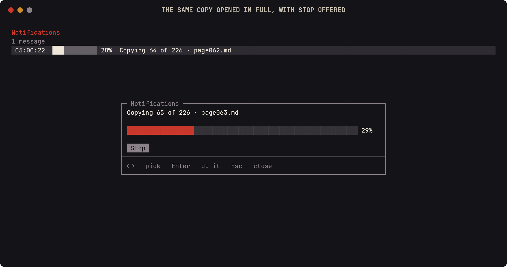

The entry turns into what came of it, in place:

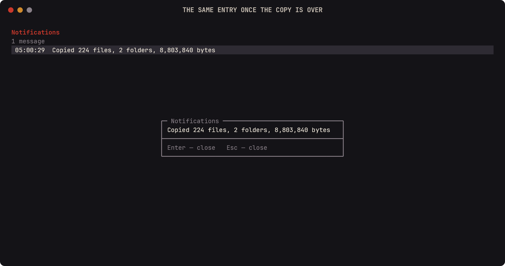

### Servers

Hosts come from `~/.ssh/config`:

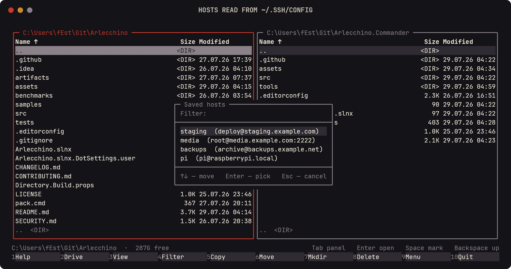

A panel browses one over SFTP:

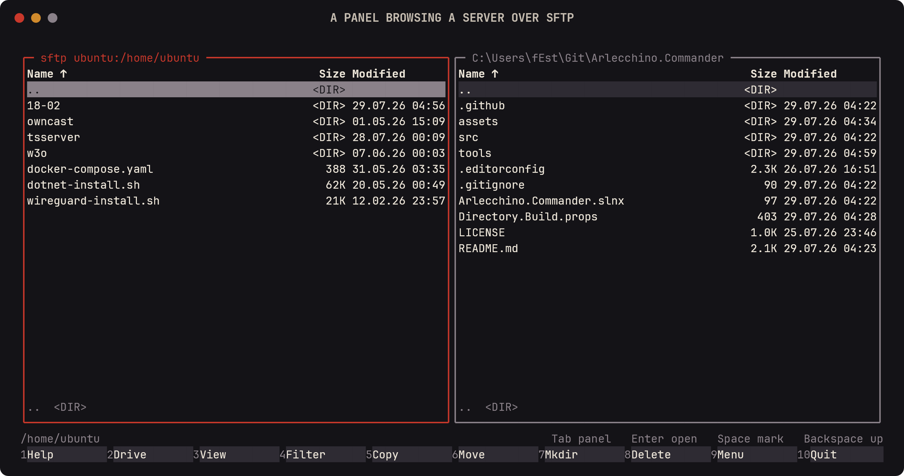

And a command runs on it:

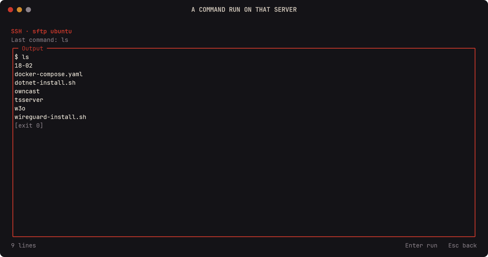

### What comes with the framework

The keys screen is the framework's own:

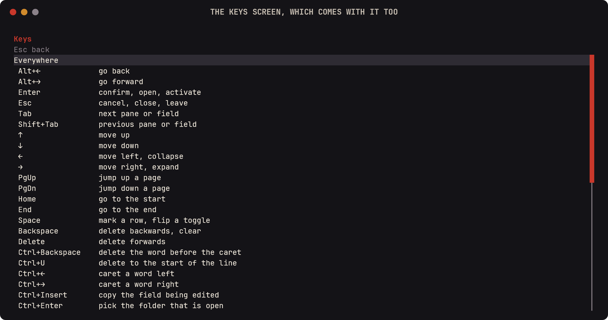

</details>

## Quick start

```
dotnet add package Arlecchino
```

A view is a class implementing `IArlecchinoView`. Constructor parameters come from the container:

```csharp
public class DefaultView : IArlecchinoView
{
    private readonly Surface _surface;

    public DefaultView(Surface surface) => _surface = surface;

    public void Draw()
    {
        _surface.AppendLine("hello", Theme.Header, Align.Center);
    }

    public ViewRoute Handle(ConsoleKeyInfo key) =>
        key.Key == ConsoleKey.A ? ViewKind.About : ViewRoute.None;

    public (string Key, string Description)[] Hints() => [("a", "about")];
}
```

Routes come from a source generator that finds every `IArlecchinoView` in the project, so
`ViewKind.About` reads like an enum while staying a plain string route the framework can name.

Starting the application is nine lines:

```csharp
using MyApp.Navigation;

var builder = Host.CreateApplicationBuilder(args);

builder.Services
    .AddArlecchino(options => options.MinimumWidth = 60)
    .AddGeneratedViews()
    .AddGeneratedStores()
    .AddGeneratedCommands()
    .StartAt(ViewKind.Default);

await builder.Build().RunAsync();
```

`ViewKind` and `AddGeneratedViews` are written into `$(RootNamespace).Navigation` — `MyApp.Navigation`
above — so the file that starts the application needs that `using`. Both appear as soon as the package
is referenced, and `ViewKind` fills up with a route per view.

Modals for text, passwords, email and links, numbers, sliders, toggles, single and multiple choice,
dates, times and colours come with the framework, along with a command palette, a hints box and a
file picker. Numbers are drawn by `Sparkline`, `BarChart<T>` and `Gauge`.

## Why this one

**A view is tested like any other class.** The headless host lives in its own package:

```
dotnet add package Arlecchino.Testing
```

It builds the whole application against a terminal in memory, and frames are drawn when a test asks
for one — there is nothing to wait for and nothing to race against:

```csharp
using var app = new ArlecchinoTestHost(configure: arlecchino =>
    arlecchino.AddGeneratedViews().StartAt(ViewKind.Default));

Assert.Contains("hello", app.Frame(), StringComparison.Ordinal);

app.Press(ConsoleKey.A);

Assert.Equal(ViewKind.About, app.Navigator.CurrentRoute);
```

Work on a timer is tested the same way: `app.Advance(TimeSpan.FromSeconds(1))` moves the clock rather
than sleeping, and the next frame shows what fell due.

**Undo comes with the state.** State lives in atoms: writing one notifies whatever reads it and marks
the frame stale, so nothing asks for a repaint by hand. Which edits can be taken back is decided by
the type — a `TrackedAtom<T>` records its writes, a `LocalAtom<T>` does not — and `AtomHistory`,
resolved from the container, walks them with `Undo` and `Redo`. Writes made inside `Group()` come
back as one step, so a dialog that changes three fields is undone once.

**Logging does not draw over the frame.** An `ILogger` resolved from the container writes into a
buffer the framework keeps, and `Ctrl+L` shows that buffer over the running application. The provider
is registered by default, since one that wrote to standard output would draw straight across the
screen.

**Native AOT is checked rather than claimed.** Each build publishes the sample as a native binary and
asks it for a frame; a native build that draws nothing fails the build.

**The keys and the words belong to the application.** The key map is a record, so
`keymap with { Cancel = new(ConsoleKey.Q) }` rebinds one key and every hint and palette entry
relabels itself. Every string the framework draws is a delegate, and `UseNativeInput()` takes
layouts that are not Latin.

## Where it sits

[Spectre.Console](https://github.com/spectreconsole/spectre.console) writes to the console — tables,
charts, prompts, live displays — rather than running a screen. Asked about prompts inside a layout,
its maintainer answered that this is
["not supported, and that is by design"](https://github.com/spectreconsole/spectre.console/discussions/1452),
and pointed to Terminal.Gui for interactive work.
[Terminal.Gui](https://github.com/tui-cs/Terminal.Gui) is the mature one: fifty built-in views, a
repository that goes back to 2017, an `Application`/`Window`/`View` model that controls are added to,
and no hosting integration. [Spectre.Tui](https://github.com/spectreconsole/spectre.tui), from the same team as
Spectre.Console, is a few months old and marked "under construction".
[Termina](https://github.com/Aaronontheweb/termina) is the closest in intent — dependency injection,
the Generic Host, ASP.NET Core-style routes — and gets there through reactive MVVM: `ReactiveProperty`
and declarative layout trees.

Arlecchino keeps the view a plain class: constructor injection, a `Draw`, a `Handle`, and routes the
generator writes from the views it finds. Modals, the command palette, the keys screen and the file
picker come with it, and every string they draw is a delegate an application can point at its own
translations. It is also younger than all four by a wide margin, and the only one that still builds
for `net8.0` — the others require .NET 10. Checked in July 2026.

## [Documentation](https://the1fest.github.io/Arlecchino.Docs/)

What changed between versions is in the [changelog](CHANGELOG.md).

## Packages

| Package | Contents |
|---|---|
| `Arlecchino.Core` | `Surface`, `Theme`, `TermColor`, `KeyText`, `IArlecchinoTerminal` — the renderer, no DI — and atoms with their undo history |
| `Arlecchino` | views, navigation, modals, commands, hosting, DI, async stores, and the generator |
| `Arlecchino.Testing` | `ArlecchinoTestHost` — the headless host applications write their tests against |

## Contributing

What the build expects of a change is in [CONTRIBUTING.md](CONTRIBUTING.md); how to report something
that looks like a security problem is in [SECURITY.md](SECURITY.md).

## License

MIT.
