<p align="center">
  
</p>

<p align="center">
  <a href="https://www.nuget.org/packages/Arlecchino"></a>
  <a href="https://www.nuget.org/packages/Arlecchino"></a>
  <a href="https://github.com/The1fEst/Arlecchino/actions/workflows/build.yml"></a>
  
  <a href="LICENSE"></a>
</p>

A terminal UI framework for .NET. Views are plain classes, navigation keeps a history, and everything
is wired through `Microsoft.Extensions.DependencyInjection`.

```
dotnet add package Arlecchino
```

## What it looks like

`samples/Arlecchino.Packages` is a dependency review of a .NET solution, built on the framework and
shown here reading the fixture solution that ships beside it — a sortable table, tabs, a tree, a form
on atoms, every modal, the command palette and the file picker:

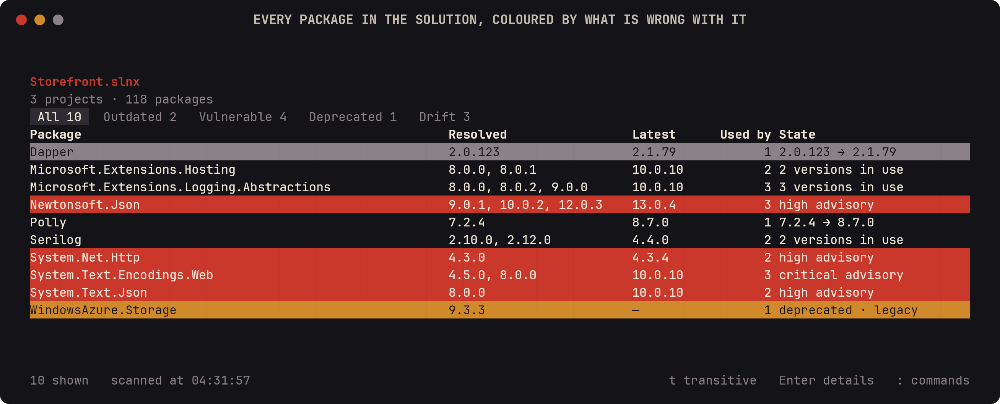

<details>
<summary><b>Seventeen more screens</b> — scanning, tabs, the tree, the upgrade form, modals, the palette, the file picker</summary>

### Finding out what is there

Four `dotnet list package` passes, reported while they run:

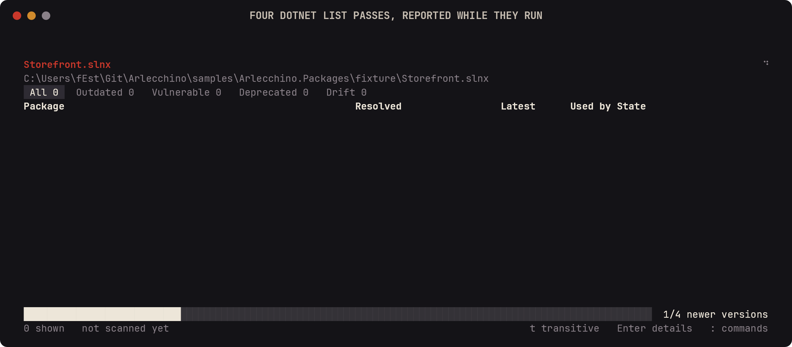

The hints box is off by default and `:h` brings it back:

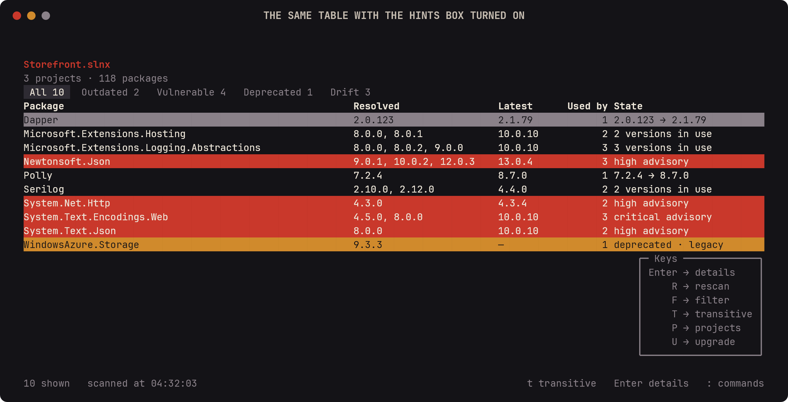

Tabs narrow the table down to one kind of problem:

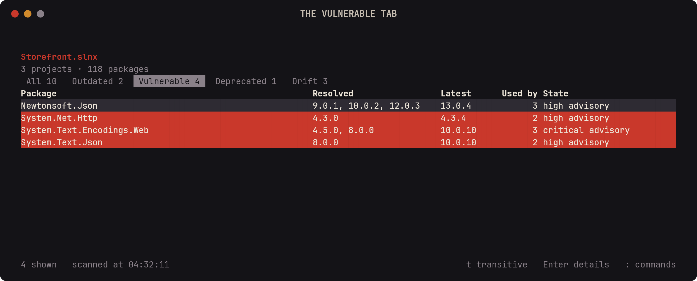

Transitive packages fold in, and the list grows a scroll bar:

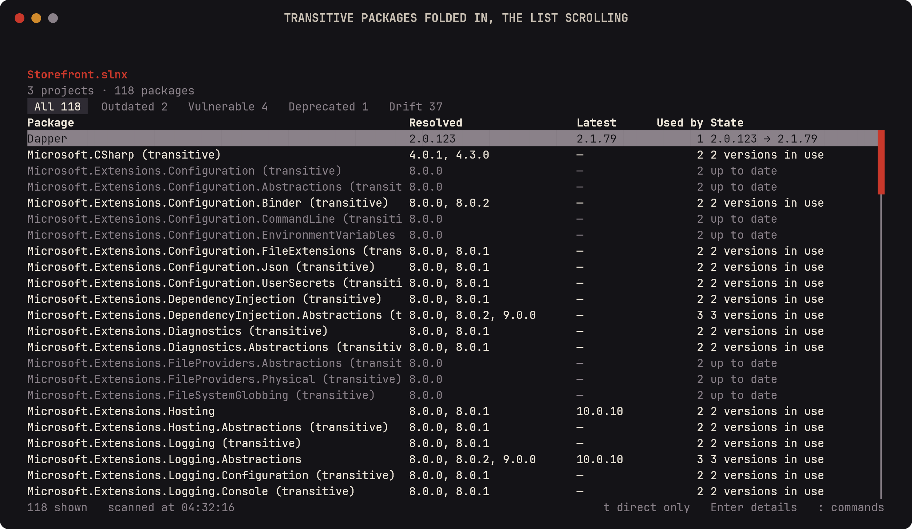

A text modal filters it:


### The other screens

One package, its advisories and every project that pulls it in:

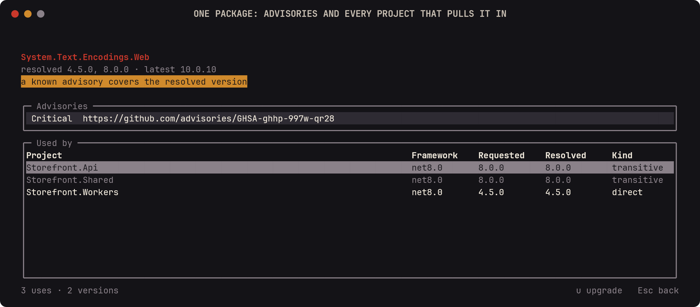

The dependency tree beside a per-project table:

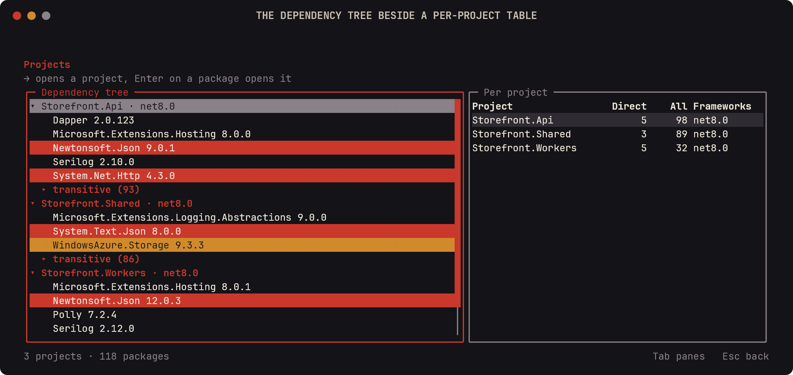

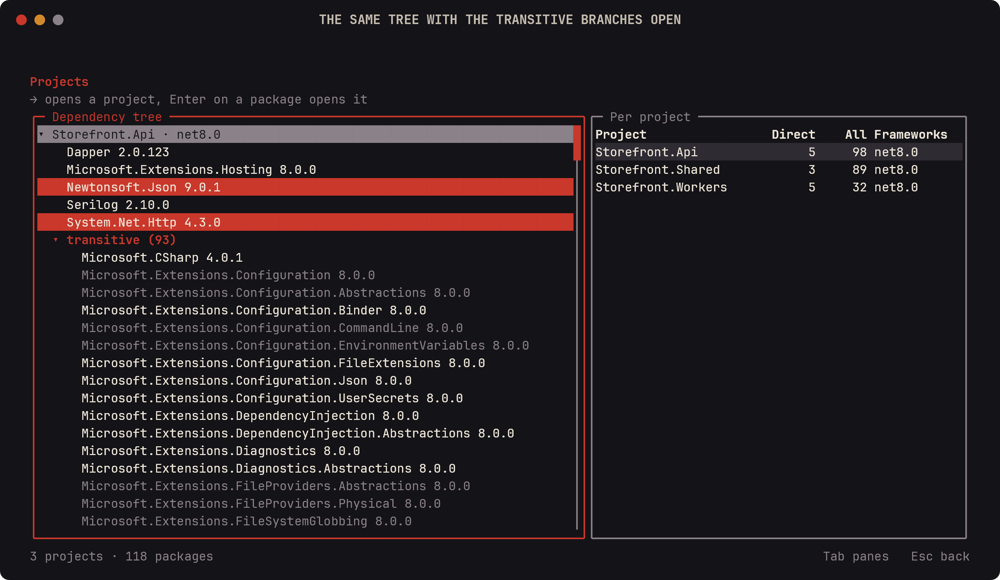

An upgrade form built from atoms, and the commands it would run:

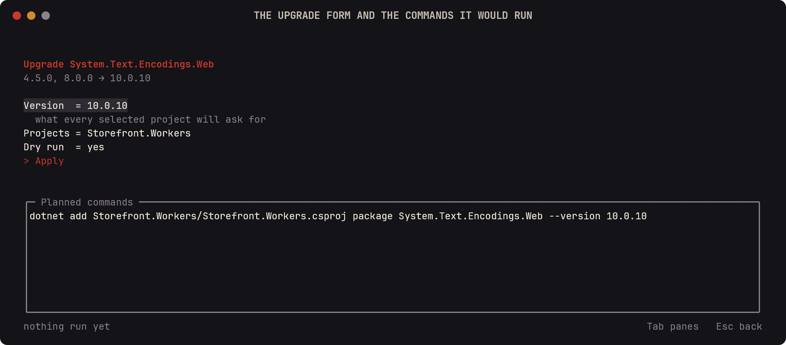

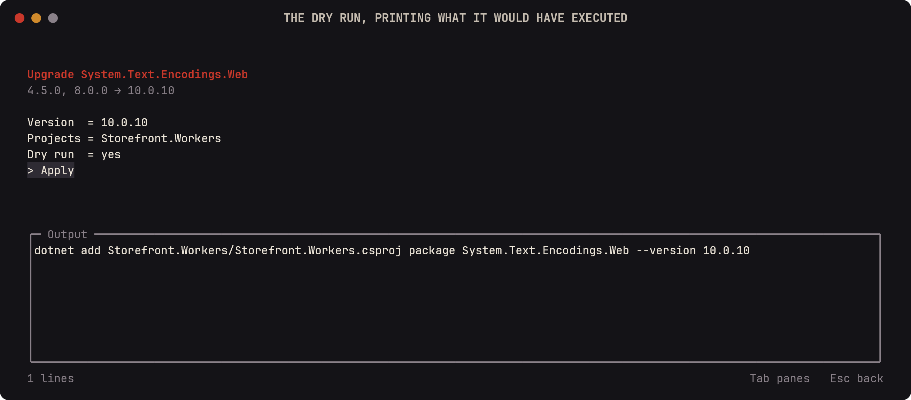

### Modals and chrome

Choice, multi-choice and confirmation, opened by the form's own fields:

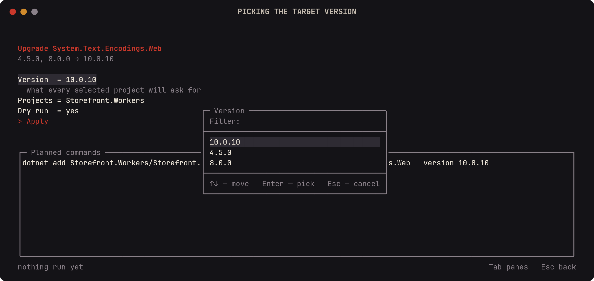

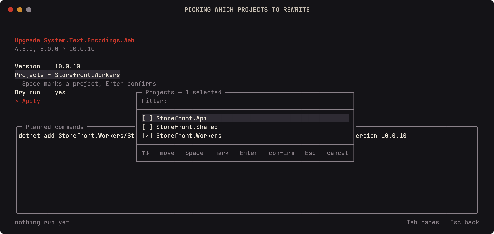

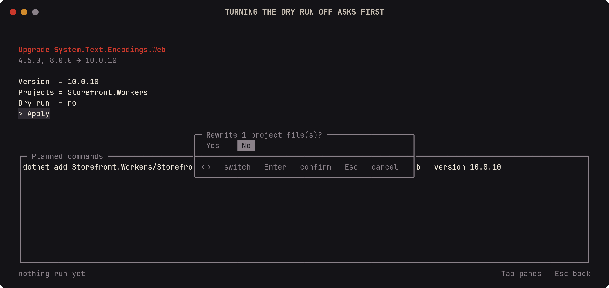

The command palette, the keys screen, the file picker and the log overlay all come with the framework:

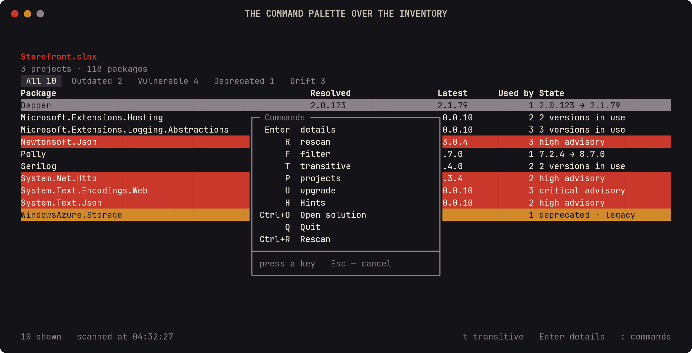


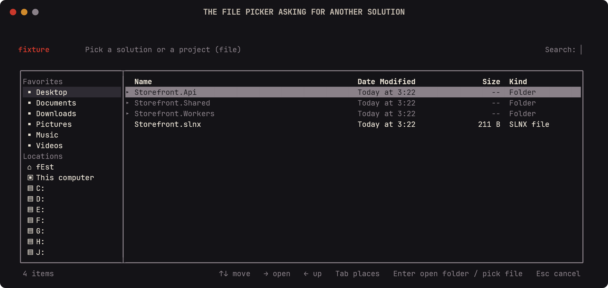

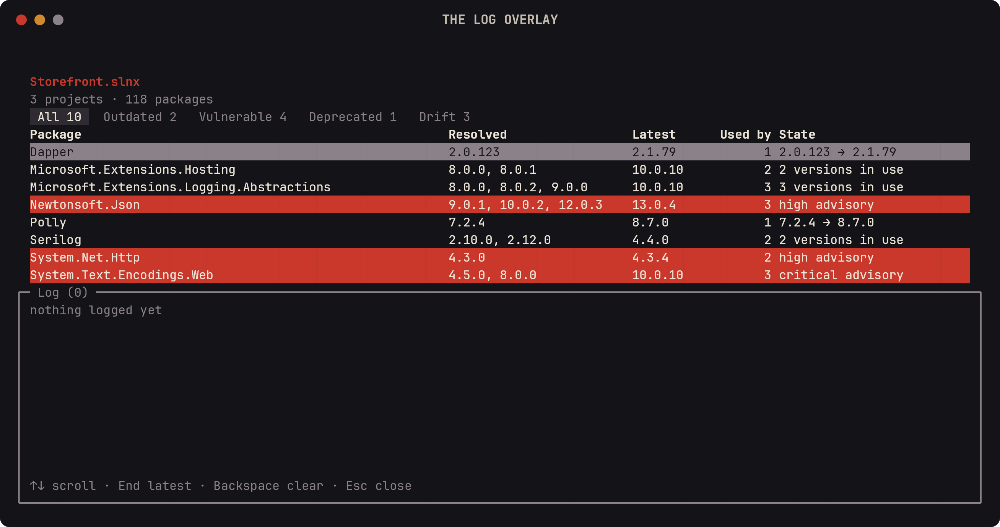

</details>

## The shortest app

```csharp
using MyApp.Navigation;   // where the generator puts ViewKind and AddGeneratedViews

var builder = Host.CreateApplicationBuilder(args);

builder.Services
    .AddArlecchino(options => options.MinimumWidth = 60)
    .AddGeneratedViews()
    .AddGeneratedStores()
    .AddGeneratedCommands()
    .StartAt(ViewKind.Default);

await builder.Build().RunAsync();
```

`ViewKind` and `AddGeneratedViews` are written by the source generator into
`$(RootNamespace).Navigation` — `MyApp.Navigation` above — so the file that starts the application
needs that `using`. Both appear as soon as the package is referenced, and `ViewKind` fills up with a
route per view.

A view is a class implementing `IArlecchinoView`. Constructor parameters come from the container:

```csharp
public class DefaultView : IArlecchinoView
{
    private readonly Surface _surface;

    public DefaultView(Surface surface) => _surface = surface;

    public void Draw()
    {
        _surface.AppendLine("hello", Theme.Header, Align.Center);
    }

    public ViewRoute Handle(ConsoleKeyInfo key) =>
        key.Key == ConsoleKey.A ? ViewKind.About : ViewRoute.None;

    public (string Key, string Description)[] Hints() => [("a", "about")];
}
```

Routes come from a source generator that finds every `IArlecchinoView` in the project, so `ViewKind.About` reads
like an enum while staying a plain string route the framework can name. Modals for text, passwords,
email and links, numbers, sliders, toggles, single and multiple choice, dates, times and colours come
with the framework, along with a command palette, a hints box and a file picker — and
every string any of them draws is a delegate the application can point at its own translations.

## Documentation

Everything lives at **[the1fest.github.io/Arlecchino.Docs](https://the1fest.github.io/Arlecchino.Docs/)** —
written pages and an API reference generated from the assemblies. The site is built from
[The1fEst/Arlecchino.Docs](https://github.com/The1fEst/Arlecchino.Docs).

| | |
|---|---|
| [Getting started](https://the1fest.github.io/Arlecchino.Docs/docs/getting-started) | Installing the package, the smallest app that runs, the first view |
| [Views and navigation](https://the1fest.github.io/Arlecchino.Docs/docs/views-and-navigation) | `IArlecchinoView`, `ViewRoute`, the navigator, history, view registration |
| [The frame loop](https://the1fest.github.io/Arlecchino.Docs/docs/frame-loop) | When a frame is drawn, which thread draws it, and how work gets back onto it |
| [Rendering](https://the1fest.github.io/Arlecchino.Docs/docs/rendering) and [Layout](https://the1fest.github.io/Arlecchino.Docs/docs/layout) | `Surface`, the flow cursor, absolute calls, regions and clipping |
| [Theming](https://the1fest.github.io/Arlecchino.Docs/docs/theming) and [Colours](https://the1fest.github.io/Arlecchino.Docs/docs/colours) | Roles, palettes, `TermColor`, and what the terminal can actually show |
| [Keyboard](https://the1fest.github.io/Arlecchino.Docs/docs/keyboard), [Commands](https://the1fest.github.io/Arlecchino.Docs/docs/commands), [Mouse](https://the1fest.github.io/Arlecchino.Docs/docs/mouse) | How a key travels, the keymap, the palette, hit-testing |
| [Atoms](https://the1fest.github.io/Arlecchino.Docs/docs/atoms) and [Forms](https://the1fest.github.io/Arlecchino.Docs/docs/forms) | Observable state, undo, and forms built from it |
| [Widgets](https://the1fest.github.io/Arlecchino.Docs/docs/widgets) | Lists, trees, sortable tables, tabs, scrolling, status bar |
| [Testing](https://the1fest.github.io/Arlecchino.Docs/docs/testing) | `ArlecchinoTestHost`, `FakeTerminal`, asserting on a frame |
| [Migrating to 2.0](https://the1fest.github.io/Arlecchino.Docs/docs/migrating-to-2.0) | The edits an application written against `1.x` needs |
| [API reference](https://the1fest.github.io/Arlecchino.Docs/docs/api) | Every public type, generated from the XML documentation |

What changed between versions is in the [changelog](CHANGELOG.md).

## Packages

| Package | Contents |
|---|---|
| `Arlecchino.Core` | `Surface`, `Theme`, `TermColor`, `KeyText`, `IArlecchinoTerminal` — the renderer, no DI |
| `Arlecchino` | views, navigation, modals, commands, hosting, DI, and the generator |
| `Arlecchino.Testing` | `ArlecchinoTestHost` — the headless host applications write their tests against |

## Contributing

What the build expects of a change is in [CONTRIBUTING.md](CONTRIBUTING.md); how to report something
that looks like a security problem is in [SECURITY.md](SECURITY.md).

## License

MIT.
